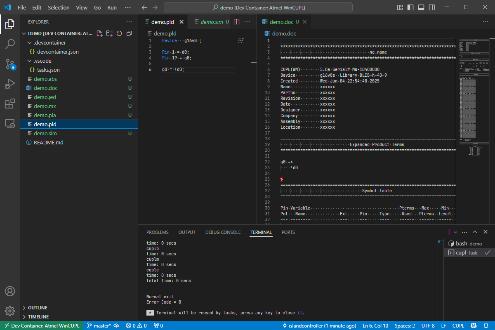

# atmel-wincupl-devcontainer
   

*Atmel WinCUPL development environment inside a VSCode devcontainer.*

### Packages

* Wine (32-bit)
* [Atmel WinCUPL](https://www.microchip.com/en-us/development-tool/wincupl) Version 5.30.4

### Running the demo

* Clone this repo.
* Open the `demo` subdirectory in VSCode.
* Click on the pop-up or use `F1` and run `Reopen in container`.
* In the container, open the `demo.pld` file.
* Run the default build task with `Ctrl+Shift+B`.

For more info about the demo, see the [demo README](demo/README.md).

## Usage

* Copy the [`devcontainer.json`](devcontainer.json) to your project's `.devcontainer` directory.
* Copy the [`tasks.json`](tasks.json) to your project's `.vscode` directory.
* Run the `Reopen in container` command.
* Open a CUPL source file.
* Press `Ctrl+Shift+B` to run the build task.

The default build task included with [`tasks.json`](tasks.json) will try to build the currently opened editor file.

## Help and References

* [tlgkccampbell/code-cupl](https://github.com/tlgkccampbell/code-cupl) VSCode plugin for WinCUPL

## Licensing

If not stated otherwise, the contents of this project are licensed under The MIT License. The full license text is provided in the [`LICENSE`](LICENSE) file.

    SPDX-License-Identifier: MIT